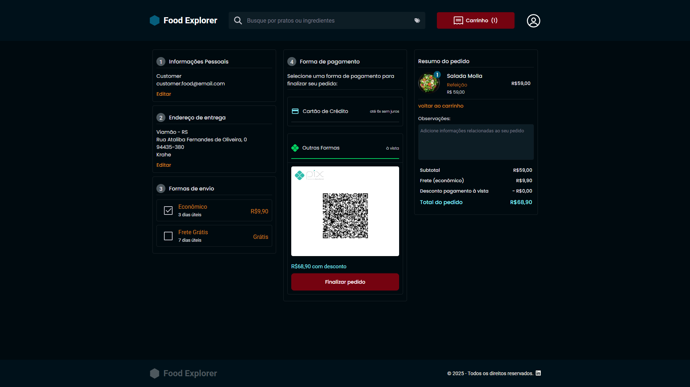
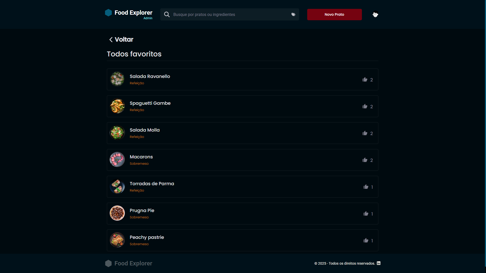
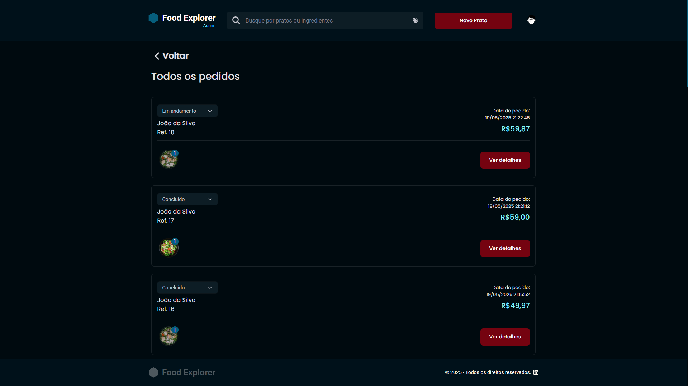

<p align="center">
</p>

<!-- [](COLAR_LINK) -->

## 📑 Índice

- [Sobre o Projeto](#sobre-o-projeto)
- [Funcionalidades](#funcionalidades)
- [Diferenciais](#diferenciais)
- [Deploy](#deploy)
- [Tecnologias](#tecnologias)
- [Layout](#layout)
- [Como Utilizar](#como-utilizar)
- [API Back-end](#api-back-end)
- [Licença](#licença)
- [Contato](#contato)

## 💡 Sobre o Projeto

O Food Explorer é uma aplicação web desenvolvida para proporcionar uma experiência completa e moderna tanto para clientes quanto para administradores de restaurantes. O sistema permite que clientes naveguem por um menu digital, adicionem pratos ao carrinho, finalizem pedidos de forma prática e acompanhem todo o processo de compra. Para o administrador, a plataforma oferece ferramentas avançadas de gestão de pedidos, análise de produtos favoritos e controle de operações, tudo em uma interface intuitiva e responsiva, pensada para funcionar perfeitamente em dispositivos desktop e mobile. O projeto foi idealizado e desenvolvido por Eduardo Bergstron como desafio final do curso Rocketseat, com foco em usabilidade, performance e escalabilidade.

## 🚀 Funcionalidades

- Consulta automática de CEP via API externa
- Carrinho de compras interativo
- Checkout completo em 4 passos
- Página do administrador com favoritos e pedidos

## ✨ Diferenciais

### Página do cliente 👇

**Consulta automática de CEP:**  
Ao atualizar o perfil, basta digitar o CEP para que o sistema busque automaticamente os dados do endereço via API externa ([viacep](https://viacep.com.br/)), agilizando o preenchimento e evitando erros.


**Carrinho de compras dinâmico:**  
O cliente pode ajustar quantidades, remover itens, atualizar o endereço de entrega e escolher entre diferentes opções de frete, tudo em tempo real, com resumo detalhado do pedido.


**Checkout simplificado:**  
O processo de compra é dividido em quatro etapas objetivas, permitindo revisão de dados, confirmação de endereço, escolha do frete e seleção da forma de pagamento (cartão ou Pix), além de espaço para observações especiais no pedido.



### Página do administrador 👇

**Gestão de produtos favoritos:**  
O administrador visualiza rapidamente os pratos mais favoritados, facilitando a criação de promoções e ações de marketing direcionadas. É possível editar informações dos produtos diretamente a partir dessa visualização.



**Processamento eficiente de pedido:**  
Todos os pedidos são exibidos de forma organizada, permitindo ao administrador acompanhar o status, acessar detalhes completos e atualizar o andamento de cada compra, otimizando o fluxo operacional do restaurante.



## 🌐 Deploy

 Acesse: Em breve... <!-- [COLAR_LINK](COLAR_LINK) -->

## 🛠️ Tecnologias

As seguintes tecnologias foram empregadas na criação deste projeto:

- [Splide](https://splidejs.com/): Criação de sliders ou carrosséis responsivos e personalizáveis em páginas da web.
- [Axios](https://axios-http.com/): Simplifica e facilita a realização de solicitações HTTP em navegadores e ambientes Node.js.
- [React](https://react.dev/): Construção de interfaces de usuário (UI) interativas e reativas em aplicações web.
- [React-dom](https://react.dev/): Extensão específica do React projetada para lidar com a manipulação do DOM (Document Object Model).
- [React-icons](https://react-icons.github.io/react-icons/): Biblioteca que fornece ícones populares e amplamente utilizados para serem incorporados em projetos React.
- [react-router-dom](https://reactrouter.com/): Biblioteca React, projetada para facilitar a navegação entre diferentes componentes.
- [styled-components](https://styled-components.com/): Permite que você escreva estilos diretamente em seus componentes React usando uma sintaxe de template literal do JavaScript.

## 🎨 Layout

O layout do Food Explorer foi cuidadosamente projetado para garantir uma navegação fluida e agradável em qualquer dispositivo. A interface segue as melhores práticas de design, com foco em acessibilidade, clareza e modernidade.  
Você pode visualizar o protótipo completo e interativo do projeto no [Figma](https://www.figma.com/design/5oyljoC8mmw46wZdHyNEjC/food-explorer-v2--Community-?m=auto&t=lFHlB9XKvfwqioaY-6) (é necessário ter uma conta gratuita para acessar).

## 📝 Como Utilizar

Clone o projeto para o local desejado em seu computador:

```bash
git clone https://github.com/B3RG5TRON/Food_Explorer_NodeJS_API.git
```

Entre na pasta raiz do repositório:

```bash
cd Food_Explorer_ReactJS
```

Instale as dependências necessárias:

```bash
npm install
```

Acesse a pasta `src/services/index.js` e insira a sua baseURL:

```javascript
import axios from "axios"

export const api = axios.create({
  baseURL: "INSIRA_AQUI_SUA_BASE_URL", //padrão utilizado: http://localhost:3333
})
```

Execute a aplicação localmente:

```bash
npm run dev
```

Clique no link apresentado no terminal segurando Ctrl.  
Exemplo:

```bash
  VITE v4.5.0  ready in 396 ms

  ➜  Local:   http://localhost:5173/ #ficará aqui
  ➜  Network: use --host to expose
  ➜  press h to show help
```

## 🔗 API Back-end

Acesse: [https://github.com/B3RG5TRON/Food_Explorer_NodeJS_API](https://github.com/B3RG5TRON/Food_Explorer_NodeJS_API)

## 📄 Licença

MIT © Eduardo Bergstron

[](LICENSE)

## 📬 Contato

Fique à vontade para entrar em contato para dúvidas, sugestões ou oportunidades de colaboração!

[](https://www.linkedin.com/in/eduardo-bergstron-986108143/)
